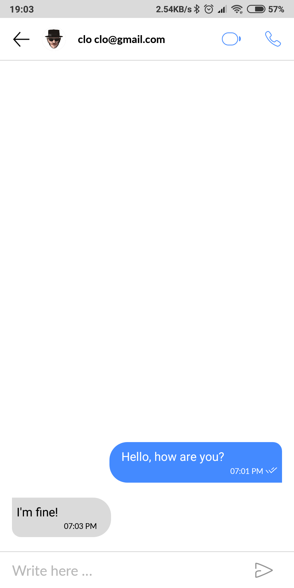
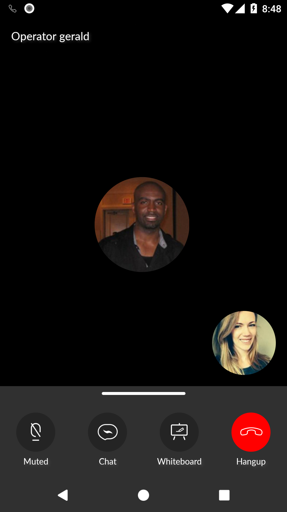
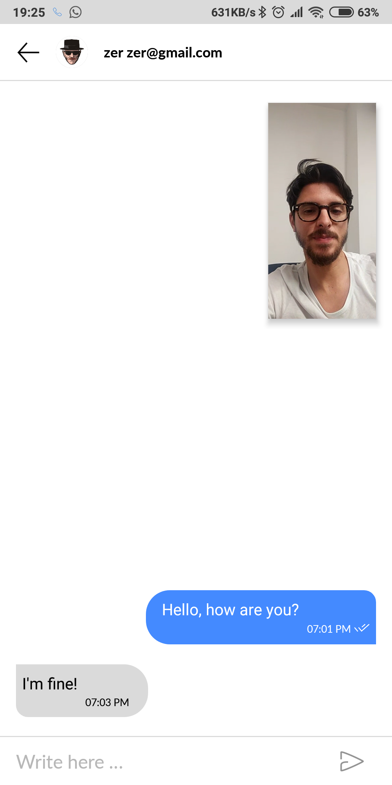

# Bandyer Android SDK

<p align="center">

</p>


[  ](https://bintray.com/bandyer/Communication/Bandyer-Android-SDK/_latestVersion)[](https://bandyer.github.io/Bandyer-Android-SDK/)
[](https://twitter.com/intent/follow?screen_name=bandyersrl)


**Bandyer** is a young innovative startup that enables audio/video communication and collaboration from any platform and browser! Through its WebRTC architecture, it makes video communication simple and punctual.


---

. **[Overview](#overview)** .
**[Features](#features)** .
**[Installation](#installation)** .
**[Getting started](#getting-started)** .
**[Documentation](#documentation)** .
**[Support](#support)** .
**[Credits](#credits)** .

---

## Overview

**Bandyer Android SDK** makes it easy to add video conference and chat communication to mobile apps.

**Even though this sdk encloses strongly the UI/UX, it is fully stylable through default Android style system.**

  

## Requirements

Bandyer Android SDK is supported from API level 16 (Android 4.1 Jelly Bean).

## Features

- Audio&Video calls
- Audio calls
- Audio calls upgradable to Video Calls
- Chat

## Installation

Download the [latest AAR](https://bintray.com/bandyer/Communication/Bandyer-Android-SDK) or grab via Gradle:

```groovy
implementation 'com.bandyer:bandyer-android-sdk:1.1.1'
```

## Getting started

To begin making calls to the Bandyer platform, you need first to obtain credentials for your app. In order to do so, you must contact our sales department. Head over to our website or contact us at <info@bandyer.com>.

### Migrating from 1.0.x

Click here for the [migration instructions](#migrating-from-1.0.x).

### Bandyer SDK configuration

Once you obtained your credentials, you must set up and initialize the sdk object in your app. 
**Bandyer SDK** must be initialized in your Application class with APP ID provided with at least one module (call and/or chat).

```java
BandyerSDK.Builder builder = new BandyerSDK.Builder(getApplicationContext(), getString(R.string.app_id))
	.setEnvironment(Environment.Configuration.sandbox())
	.withCallEnabled() 
	.withChatEnabled();

BandyerSDK.init(builder);
```

### Initialize Bandyer SDK Client

```java
BandyerSDKClientOptions options = new BandyerSDKClientOptions.Builder().build();

BandyerSDKClient.getInstance().init(userAlias);

BandyerSDKClient.getInstance().startListening(); // Start listening for incoming call
BandyerSDKClient.getInstance().stopListening(); // Stop listening for incoming call
```

### Dispose Bandyer SDK Client

```java
BandyerSDKClient.getInstance().dispose();
```

### Start an outgoing audio/video call with chat:

```java
startActivity(
	new BandyerIntent.Builder()
		.startWithAudioVideoCall(this /* context */, false /* call recording */) 
		.with(new ArrayList<>(Arrays.asList("user_A", "user_B", "user_C"))
		.withChatCapability()
		.build()
);
```

### Start a one-to-one chat:

```java
startActivity(
	new BandyerIntent.Builder()
		.startWithChat(MainActivity.this /* starting context */)
		.with("user_A")
		
		.withAudioCallCapability(false /* call recording */, false /* upgradable to audio video call */)
		// or
		.withAudioVideoCallCapability(false /* call recording */)
		
		.build()
);
```

## Migrating from 1.0.x

**Bandyer Android SDK 1.1.0** brings improvements and new features such as the possibility to customize the incoming events notifications and let you show or dismiss an incoming event based on your app's logics.

In the previous releases the module was intended as the SDK itself, **Bandyer SDK** now includes a new concept of *module*: a *module* is a sub-component of the SDK such as the call module and the chat module.

The *user aliases* details display process has been rewritten to simplify the retrieve process and let multiple *user aliases* to be retrieved in a single fetch.

In order to support this new version here are shown below few modification that are required on your current app.


- **Bandyer SDK** initialization has not changed, but you can now customize incoming events as shown here [Customize incoming events](#customize-incoming-events).

- **Bandyer SDK** client initialization does not require application context anymore because it is now requested to initialize the SDK in the Application class where the SDK itself stores a ref to the application context.

- **UserInformationFetcher** object is now not supported anymore and the updated version, named **UserContactProvider**, must be provided to the module has showed here: [user contact provider](#user-contact-provider).

- Display formatters previously passed to Bandyer intents are not requested anymore and must be provided as shown here: [user details display formatters](#user-details-display-formatters).

- **BandyerSDKNotificationConfig** object is not supported anymore. Notification customization happens now in the call and chat notification listeners provided to Bandyer module as described here: [customize incoming events](#Customize-incoming-events).


## Advanced topics

### Logging 

Enable logging for debug builds on the **BandyerSDK.Builder** object.


```java
BandyerSDK.Builder builder = new BandyerSDK.Builder(this, getString(R.string.app_id))

if (BuildConfig.DEBUG) {
	builder.setLogger(new BandyerSDKLogger() {
		@Override
		public void verbose(@NonNull String tag, @NonNull String message) {
			Log.v(tag, message);
		}

		@Override
		public void debug(@NonNull String tag, @NonNull String message) {
			Log.d(tag, message);
		}

		@Override
		public void info(@NonNull String tag, @NonNull String message) {
			Log.i(tag, message);
		}

		@Override
		public void warn(@NonNull String tag, @NonNull String message) {
			Log.w(tag, message);
		}

		@Override
		public void error(@NonNull String tag, @NonNull String message) {
			Log.e(tag, message);
		}
	});
}
```

### Observe call and chat opening and closing errors

In order to observe errors from call or chat activities you must start Bandyer intents for result and get the error has shown below.

```java

// start a call for result

startActivityForResult(
	new BandyerIntent.Builder()
		.startWithAudioVideoCall(this /* context */, false /* call recording */) 
		.with(new ArrayList<>(Arrays.asList("user_A", "user_B", "user_C"))
		.withChatCapability()
		.build()
	, START_CALL_CODE
);

// start a chat for result

startActivityForResult(
	new BandyerIntent.Builder()
		.startWithChat(MainActivity.this /* starting context */)
		.with("user_A")
        
		.withAudioCallCapability(false /* call recording */, false /* upgradable to audio video call */)
		// or
		.withAudioVideoCallCapability(false /* call recording */)
        
		.build(),
	START_CHAT_CODE
);

@Override
protected void onActivityResult(int requestCode, int resultCode, Intent data) {
	super.onActivityResult(requestCode, resultCode, data);

		if (resultCode == RESULT_CANCELED) {
			
			if (data == null) return;

			String error = data.getExtras() != null 
				? data.getExtras().getString("error", "error")
				: "error";

			switch (requestCode) {
				case START_CALL_CODE:
					Log.d(TAG, "Call ended: " + error);
					break;

				case START_CHAT_CODE:
					Log.d(TAG, "Chat closed: " + error);
					break;
			}
	}
}
```

### Observe SDK client state 

Observing client SDK status let you be notified through **BandyerSDKClientObserver** when the client is up and running, and when it is in the right state to initialize a call or a chat through **BandyerModuleObserver**, even after app has been resumed from pause. 
Although the observers are not required in order to use Bandyer SDK, you will receive errors while creating calls and chat before the client is ready, so it is highly recommended to observe status changes as showed in the following code.

```java
BandyerSDKClient.getInstance().addObserver(new BandyerSDKClientObserver() {
	@Override
	public void onClientStatusChange(BandyerSDKClientState state) {
		Log.d(TAG, "Bandyer SDK client status change: " + state);          
	}

	@Override
	public void onClientError(Throwable throwable) {
   		Log.d(TAG, "Bandyer SDK client error " + throwable.getMessage());
	}

	@Override
	public void onClientReady() {
   		Log.d(TAG, "Bandyer SDK client ready.");
	}

	@Override
	public void onClientStopped() {
   		Log.d(TAG, "Bandyer SDK client stopped.");
	}
});

BandyerSDKClient.getInstance().addModuleObserver(new BandyerModuleObserver() {
	@Override
	public void onModuleReady(BandyerModule module) {
   		if (module instanceof ChatModule) {
   			Log.d(TAG, "chat module ready! It is now possible to start a call.");
   		} else if (module instanceof CallModule) {
   			Log.d(TAG, "call module ready! It is now possible to start a chat.");
   		}
	} 

	@Override
	public void onModulePaused(BandyerModule module) {
   		Log.d(TAG, "module " + module.getName() + " paused.");
	}

	@Override
	public void onModuleFailed(BandyerModule module, Throwable throwable) {
   		Log.d(TAG, "module " + module.getName() + " failed with error " + throwable.getMessage());
	}

	@Override
	public void onModuleStatusChanged(BandyerModule module, BandyerModuleStatus moduleStatus) {
   		Log.d(TAG, "module " + module.getName() + " status change: " + moduleStatus);

	}
});
```

### Customize incoming events

Incoming calls and incoming chat messages generates events that can be displayed as notification or activities and that can be customized with the following code.
**CallNotificationListener** and **ChatNotificationListener** help you to decide whether to show an activity or a notification, giving throught onIncomingCall and onIncomingChat methods info about the device such ad screen locked status and if do not disturb mode is enabled.

#### Incoming calls

```java
BandyerSDK.Builder builder = new BandyerSDK.Builder(this, getString(R.string.app_id))

builder.withCallEnabled(
	
	new CallNotificationListener() {
		@Override
      	public void onIncomingCall(@NonNull IncomingCall incomingCall, boolean isDnd, boolean isScreenLocked) {
			if (!isDnd || isScreenLocked)
			
				// display ringing activity
				startActivity(incomingCall.asActivityIntent(App.this));
		
			else
			
				// display incoming call as system notification
				incomingCall.asNotification(App.this).show();
		}

		@Override
		public void onCallActivityStartedFromNotificationAction(@NonNull CallInfo callInfo,
                                                                    @NonNull CallIntentOptions callIntentOptions) {                                           
			callIntentOptions.withChatCapability();
		}

		@Override
		public void onCreateNotification(@NonNull CallInfo callInfo,
                                             @NonNull CallNotificationType type,
                                             @NonNull CallNotificationStyle notificationStyle) {
			notificationStyle.setNotificationColor(Color.RED);
			notificationStyle.setNotificationSmallIcon(R.drawable.ic_notification);
		}

		@Override
		public void onNotificationAction(@NonNull NotificationAction action) {
			// Here you can execute your own code before executing the default action of the notification
			action.execute();
		}
	};
);
```

#### Incoming chat messages

```java
BandyerSDK.Builder builder = new BandyerSDK.Builder(this, getString(R.string.app_id))

builder.withChatEnabled(
	
	new ChatNotificationListener() {

		@Override
		public void onIncomingChat(@NonNull IncomingChat chat, boolean isDnd, boolean isScreenLocked) {
			chat.asNotification(App.this).show();
		}

		@Override
		public void onCreateNotification(@NonNull ChatInfo chatInfo, @NonNull ChatNotificationStyle notificationStyle) {
			notificationStyle.setNotificationColor(Color.RED);
			notificationStyle.setNotificationSmallIcon(R.drawable.ic_notification);
		}

		@Override
		public void onChatActivityStartedFromNotificationAction(@NonNull ChatInfo chatInfo, @NonNull ChatIntentOptions chatIntentOptions) {
			chatIntentOptions
				.withAudioCallCapability(false, true)
				.withAudioVideoCallCapability(false);
		}

		@Override
		public void onNotificationAction(@NonNull NotificationAction action) {

		// Here you can execute your own code before executing the default action of the notification
		action.execute();
		}
	};
);
```


### User contact provider

A *user alias* is a unique identifier used to map your users in the Bandyer ecosystem.
Those identifiers cannot describe your users properly so if you would like to display *in-chat* or *in-call* users adequately you must provide details for user alias with **UserContactProvider** interface shown below.

```java
BandyerSDK.Builder builder = new BandyerSDK.Builder(this, getString(R.string.app_id))

builder.withUserContactProvider(new UserContactProvider() {
	
	@Override
	public void provideUserDetails(List<String> userAliases, OnUserInformationProviderListener<UserDetails> onProviderListener) {
		
		ArrayList<UserDetails> details = new ArrayList<>();
                       
		// fetch asynchronously data on your local or network storage for each user alias 
                        
		for(String userAlias : userAliases) {

			details.add(
				new UserDetails.Builder(userAlias)
					
					// textual info
					
					.withNickName("nickname")
					.withFirstName("name")
					.withLastName("last name")
					.withEmail("email")
					
					// visual info
					
					.withImageUrl("url")
					// or
					.withImageUri(uri)
					// or
					.withResId(resId)
					
					.build()
			);
                        
		}
                        
		// provide results on the OnUserInformationProviderListener object
		
		onProviderListener.onProvided(details);
	
	}
});

```

#### User details display formatters

Once user aliases are retrieved from your local or network storage with **UserContactProvider**, provide a formatter to display users' textual info.
The main advangtage of using **UserDetailsFormatter** is that display data can be customized based on the context that has requested the display, so for example the display of a user can differ when has to be printed on a notification or on the ringing activity.
**FormatContext** object describes wich internal module (call or chat) has requested the user to display, so you can change how user details are displayed.

```java
builder.withUserDetailsFormatter(new UserDetailsFormatter() {
	@NonNull
	@Override
	public String format(@NonNull UserDetails userDetails, @NonNull FormatContext context) {
		
		if (context.getComponent() instanceof BandyerComponent.CallComponent) {
       	if (context.isNotification())
       		return userDetails.getNickName();
       	else
				return userDetails.getEmail();
		} else {
	    	return userDetails.getFirstName() + " " +userDetails.getLastName();
       }
	}
})
```

### Manage push notifications

We highly recommend to add push notification to your app in oder to receive incoming calls even when the app is killed. 

Discover how your backend can be notified with upcoming call events registering event hooks *on_call_incoming* here: [https://docs.bandyer.com/Bandyer-RESTAPI/#webhooks](https://docs.bandyer.com/Bandyer-RESTAPI/#webhooks).

Incoming calls push payloads can be passed to the **BandyerSDKClient** singleton as showed below.
Once the sdk has been restarted and the handleNotification method has been called, you will receive the upcoming processed notification in the **CallNotificationListener** if has been setted, so you can decide to show notification or show the ringing activity.

```java
// After receiving push payload in your push service, check and eventually restart sdk client as showed here:

private void startBandyerSdkIfNeeded(String userAlias, @NonNull String pushPayload) {

  BandyerSDKClient.getInstance().removeModuleObserver(bandyerModuleObserver);

  switch (BandyerSDKClient.getInstance().getState()) {

    case RUNNING;
      return;

    case PAUSED:
      BandyerSDKClient.getInstance().addModuleObserver(
        new BandyerModuleObserver() {
          @Override
          public void onModuleStatusChanged(@NonNull BandyerModule module, @NonNull BandyerModuleStatus moduleStatus) {}	

          @Override
          public void onModuleFailed(@NonNull BandyerModule module, @NonNull Throwable throwable) {}

          @Override
          public void onModulePaused(@NonNull BandyerModule module) {}

          @Override
          public void onModuleReady(@NonNull BandyerModule module) {
            if (module instanceof CallModule) {
              BandyerSDKClient.getInstance().removeModuleObserver(this);
              
              // handle push notification
              BandyerSDKClient.getInstance().handleNotification(getApplicationContext(), pushPayload);
            }
          }
         });
       BandyerSDKClient.getInstance().resume();
       break;

    case UNINITIALIZED:
      BandyerSDKClientOptions sdkClientOptions = new BandyerSDKClientOptions.Builder().build();
      BandyerSDKClient.getInstance().init(userAlias, sdkClientOptions);
      BandyerSDKClient.getInstance().addModuleObserver(bandyerModuleObserver);
      BandyerSDKClient.getInstance().startListening();
      break;

  }
}
```

### Manage *join urls*

After *on_call_incoming* hook has been registered on your backend it is possible to parse the received payload and obtain http urls that can be used typically to send an incoming call email notification to your users.
Once the url is managed by the app and parsed by a browsable activity, that url can be passed to the **BandyerSDKClient** that has been opportunely restarted if needed has shown below.

```java
private void onJoinUrlReceived(String userAlias, @NonNull String joinUrl) {

  BandyerSDKClient.getInstance().removeModuleObserver(bandyerModuleObserver);

  switch (BandyerSDKClient.getInstance().getState()) {

    case RUNNING:
    return;

    case PAUSED:
      BandyerSDKClient.getInstance().addModuleObserver(
        new BandyerModuleObserver() {
          @Override
          public void onModuleStatusChanged(@NonNull BandyerModule module, @NonNull BandyerModuleStatus moduleStatus) {}	

          @Override
          public void onModuleFailed(@NonNull BandyerModule module, @NonNull Throwable throwable) {}

          @Override
          public void onModulePaused(@NonNull BandyerModule module) {}

          @Override
          public void onModuleReady(@NonNull BandyerModule module) {
            if (module instanceof CallModule) {
            
               startActivityForResult(
               		new BandyerIntent.Builder()
               			.startFromJoinCallUrl(this, joinUrl)
                    	.withChatCapability(), //optional
              		START_CALL_CODE
               );
            }
          }
         });
       BandyerSDKClient.getInstance().resume();
       break;

    case UNINITIALIZED:
      BandyerSDKClientOptions sdkClientOptions = new BandyerSDKClientOptions.Builder().build();
      BandyerSDKClient.getInstance().init(userAlias, sdkClientOptions);
      BandyerSDKClient.getInstance().addModuleObserver(bandyerModuleObserver);
      BandyerSDKClient.getInstance().startListening();
      break;

  }
}
```

### Extras

There are few other options that can be passed to the **BandyerSDKClient** singleton.
For debug purposes it is possibile to prevent client to be stopped while the app is going in background.
We highly recommend to add push notification to your app in oder to receive incoming calls even when the app is killed. 

Discover how your backend can be notified with upcoming call events registering event hooks here: [https://docs.bandyer.com/Bandyer-RESTAPI/#webhooks](https://docs.bandyer.com/Bandyer-RESTAPI/#webhooks).

```java
 BandyerSDKClientOptions options = new BandyerSDKClientOptions.Builder()
	.keepListeningForEventsInBackground(false)
	.build();
	
BandyerSDKClient.getInstance().init(userAlias, options);
```

## Documentation

You can find the complete documentation in two different styles

Kotlin Doc: [https://bandyer.github.io/Bandyer-Android-SDK/kDoc/](https://bandyer.github.io/Bandyer-Android-SDK/kDoc/)

Java Doc: [https://bandyer.github.io/Bandyer-Android-SDK/jDoc/](https://bandyer.github.io/Bandyer-Android-SDK/jDoc/)

## Customize style
- Documentation coming soon

## Pricing
Contact us at <mailto:info@bandyer.com> to get your *APP_ID* and *API_KEY* if you don't have one yet!

## Support
To get basic support please submit an [Issue](https://github.com/Bandyer/Bandyer-Android-SDK/issues).

If you prefer commercial support, please contact [bandyer.com](https://bandyer.com) by mail: <mailto:info@bandyer.com>.


## Credits
- [WebRTC](https://webrtc.org/) by Google, Mozilla, Opera, W3C and ITF
- [Gson](https://github.com/google/gson) by Google
- [Android-weak-handler](https://github.com/badoo/android-weak-handler) by Badoo
- [Socket.io](https://github.com/socketio/socket.io-client-java) by socket.io


