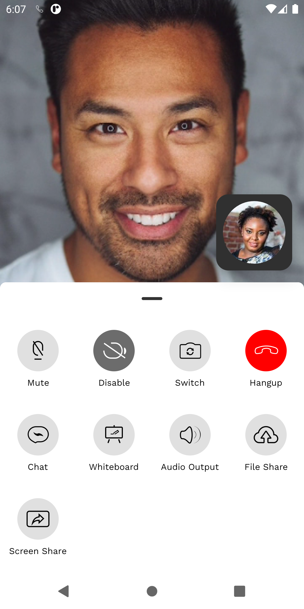
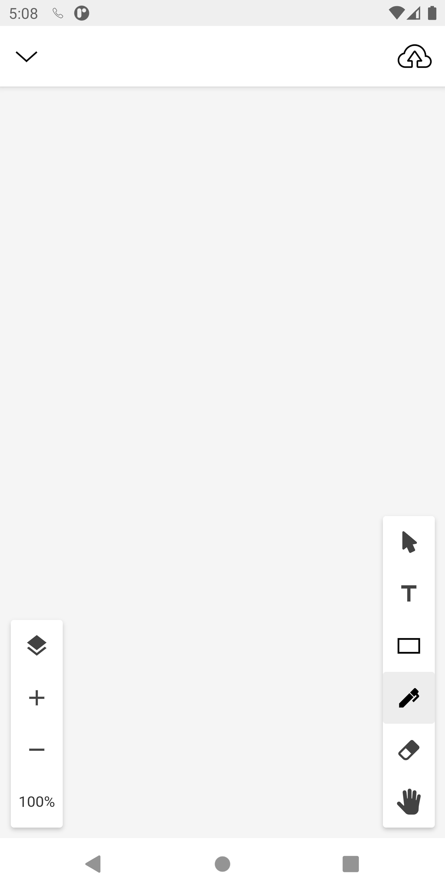
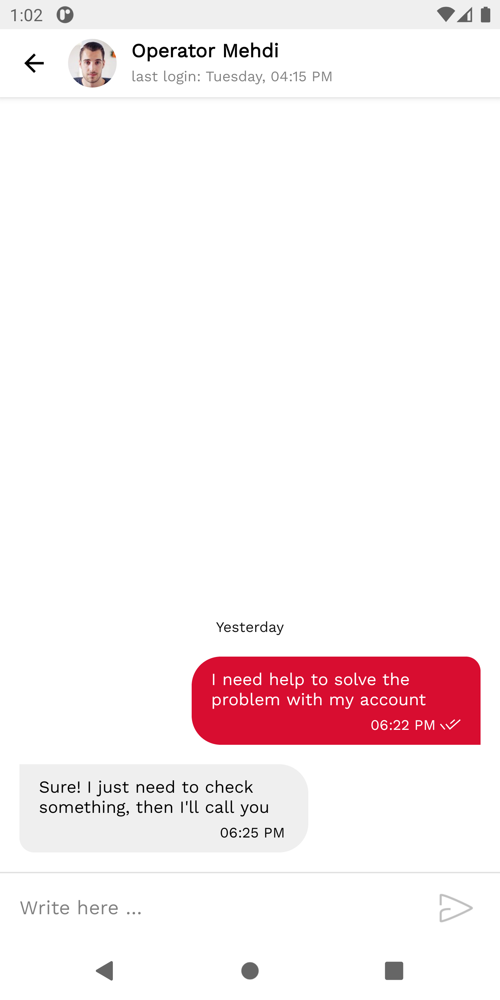

# Bandyer Android SDK

<p align="center">

</p>


[  ](https://bintray.com/bandyer/Communication/Bandyer-Android-SDK/_latestVersion)[](https://bandyer.github.io/Bandyer-Android-SDK/)
[](https://twitter.com/intent/follow?screen_name=bandyersrl)


**Bandyer** is a young innovative startup that enables audio/video communication and collaboration from any platform and browser! Through its WebRTC architecture, it makes video communication simple and punctual.


---

. **[Overview](#overview)** .
**[Features](#features)** .
**[News](#news)** .
**[Documentation](#documentation)** .
**[Pricing](#other)** .
**[Credits](#credits)** .

---

## Overview

**Bandyer Android SDK** makes it easy to add video conference and chat communication to mobile apps.

**Even though this sdk encloses strongly the UI/UX, it is fully stylable through default Android style system.**

 

## Requirements

Bandyer Android SDK is supported from API level 16 (Android 4.1 Jelly Bean).

**Bandyer Android SDK requires compileOptions for Java8**
```java
android {
    compileOptions {
        sourceCompatibility JavaVersion.VERSION_1_8
        targetCompatibility JavaVersion.VERSION_1_8
    }
}
```
## Latest releases

AndroidX >= **v1.3.0**

Support AppCompat <= **v1.2.1**


## Features

- Audio call
- Audio call upgradable to video call
- Video call
- Chat
- Collaborative whiteboard 
- File sharing in call
- Screen sharing in call
- Call Recording

## News 1.5.x
- 2020-09-10: Bandyer-Android-SDK 1.5.7 has been released. Improved UI/UX and fixed minor bugs. For other changes read the [release notes](https://github.com/Bandyer/Bandyer-Android-SDK/releases/tag/v1.5.7).

## News 1.4.x
- 2020-09-11: Bandyer-Android-SDK 1.4.14 has been released. Improved UI/UX and fixed minor bugs. For other changes read the [release notes](https://github.com/Bandyer/Bandyer-Android-SDK/releases/tag/v1.4.14).

## Documentation

### Introduction
[Home](https://github.com/Bandyer/Bandyer-Android-SDK/wiki/Home)

### Integration
1. [Get your credentials](https://github.com/Bandyer/Bandyer-Android-SDK/wiki/Get-Your-Credentials)
1. [Get started](https://github.com/Bandyer/Bandyer-Android-SDK/wiki/Get-Started)
1. [Terminology](https://github.com/Bandyer/Bandyer-Android-SDK/wiki/Terminology)
1. [Android Studio Setup](https://github.com/Bandyer/Bandyer-Android-SDK/wiki/Android-Studio-Setup)
1. [Initialize SDK](https://github.com/Bandyer/Bandyer-Android-SDK/wiki/Initialize-BandyerSDK)
1. [Setup BandyerSDKClient](https://github.com/Bandyer/Bandyer-Android-SDK/wiki/Initialize-BandyerSDKClient)
    - [Initialize Client](https://github.com/Bandyer/Bandyer-Android-SDK/wiki/Initialize-BandyerSDKClient)
    - [Destroy Client](https://github.com/Bandyer/Bandyer-Android-SDK/wiki/Initialize-BandyerSDKClient#dispose-bandyersdkclient)
    - [Delete user data](https://github.com/Bandyer/Bandyer-Android-SDK/wiki/Initialize-BandyerSDKClient#clear-all-user-data)
    - [Observe Client](https://github.com/Bandyer/Bandyer-Android-SDK/wiki/Initialize-BandyerSDKClient#bandyersdkclient-observers)
1. [Start a Call](https://github.com/Bandyer/Bandyer-Android-SDK/wiki/Start-a-call)
1. [Observe Call Events](https://github.com/Bandyer/Bandyer-Android-SDK/wiki/Observe-call-events)
1. [Start a Chat](https://github.com/Bandyer/Bandyer-Android-SDK/wiki/Start-a-chat)
1. [Observe Chat Events](https://github.com/Bandyer/Bandyer-Android-SDK/wiki/Observe-Chat-Events)
1. [Handle Push Notifications](https://github.com/Bandyer/Bandyer-Android-SDK/wiki/Handle-Push-Notifications)
1. [Handle External Links](https://github.com/Bandyer/Bandyer-Android-SDK/wiki/Handle-External-Links)


### Notification Customization
[Call](https://github.com/Bandyer/Bandyer-Android-SDK/wiki/Customize-Call-Module-Notifications)

[Chat](https://github.com/Bandyer/Bandyer-Android-SDK/wiki/Customize--Chat-Module-Notifications)

[FileSharing](https://github.com/Bandyer/Bandyer-Android-SDK/wiki/Customize-FileSharing-Notifications)

### User Details Display Customization
[User Details Provider](https://github.com/Bandyer/Bandyer-Android-SDK/wiki/User-details-provider)

[User Details Formatter](https://github.com/Bandyer/Bandyer-Android-SDK/wiki/User-details-formatter)

### More
[Logging](https://github.com/Bandyer/Bandyer-Android-SDK/wiki/Logging)

[Call UI Display Mode](https://github.com/Bandyer/Bandyer-Android-SDK/wiki/Call-UI-Display-Mode)

[User Identity Verification](https://github.com/Bandyer/Bandyer-Android-SDK/wiki/User-Identity-Verification)

[Unexpected exception handling](https://github.com/Bandyer/Bandyer-Android-SDK/wiki/Unexpected-exception-handling)

[Keep BandyerSDKClient Alive](https://github.com/Bandyer/Bandyer-Android-SDK/wiki/Keep-client-active-in-background)

[Reduce APK size](https://github.com/Bandyer/Bandyer-Android-SDK/wiki/Reduce-the-APK-size)

[Proguard](https://github.com/Bandyer/Bandyer-Android-SDK/wiki/Proguard)

### Customize UI
> Coming soon 

### Migrations

[Upgrade to v1.1.x](https://github.com/Bandyer/Bandyer-Android-SDK/wiki/Upgrade-to-BandyerSDK-1.1.x)

[Upgrade to v1.2.x](https://github.com/Bandyer/Bandyer-Android-SDK/wiki/Upgrade-to-BandyerSDK-1.2.x)

[Upgrade to v1.3.x](https://github.com/Bandyer/Bandyer-Android-SDK/wiki/Upgrade-to-BandyerSDK-1.3.x)

[Upgrade to v1.4.x](https://github.com/Bandyer/Bandyer-Android-SDK/wiki/Upgrade-to-BandyerSDK-1.4.x)

[Upgrade to v1.5.x](https://github.com/Bandyer/Bandyer-Android-SDK/wiki/Upgrade-to-Bandyer-SDK-v1.5.x)


### Code documentation
[Kotlin](https://bandyer.github.io/Bandyer-Android-SDK/kDoc/)

[Java](https://bandyer.github.io/Bandyer-Android-SDK/jDoc/)

### Other
[Pricing](https://github.com/Bandyer/Bandyer-Android-SDK/wiki/Pricing)

[Troubleshooting](https://github.com/Bandyer/Bandyer-Android-SDK/wiki/Troubleshooting)


## Credits
- [WebRTC](https://webrtc.org/) by Google, Mozilla, Opera, W3C and ITF
- [Kotlin](https://github.com/JetBrains/kotlin) by JetBrains
- [Gson](https://github.com/google/gson) by Google
- [OkHttp](https://github.com/square/okhttp) by square
- [Socket.io](https://github.com/socketio/socket.io-client-java) by socket.io
- [Android-weak-handler](https://github.com/badoo/android-weak-handler) by Badoo
- [SiliCompressor](https://github.com/Tourenathan-G5organisation/SiliCompressor) by Tourenathan-G5organisation
- [PermissionsDispatcher](https://github.com/permissions-dispatcher/PermissionsDispatcher) by permissions-dispatcher
- [Matisse](https://github.com/zhihu/Matisse) by zhihu
- [Twilio Programmable Chat](https://www.twilio.com/chat) by twilio
- [Retrofit](https://github.com/square/retrofit) by square
- [Picasso](https://github.com/square/picasso) by square
- [Paris](https://github.com/airbnb/paris/) by airbnb
- [FastAdapter](https://github.com/mikepenz/FastAdapter) by mikepenz
